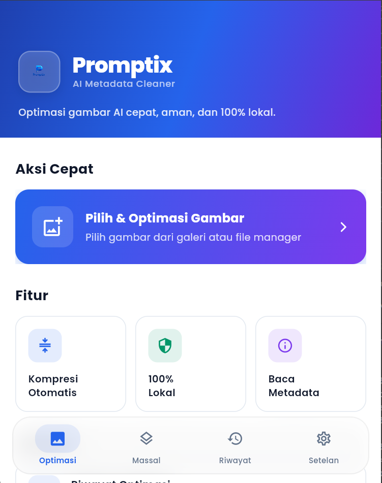
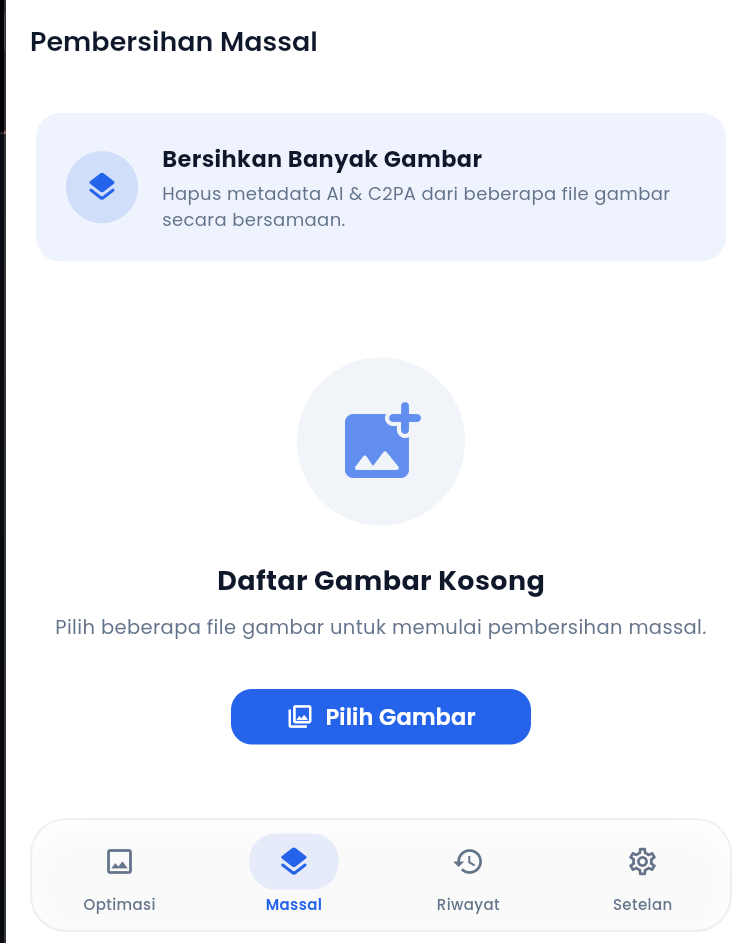
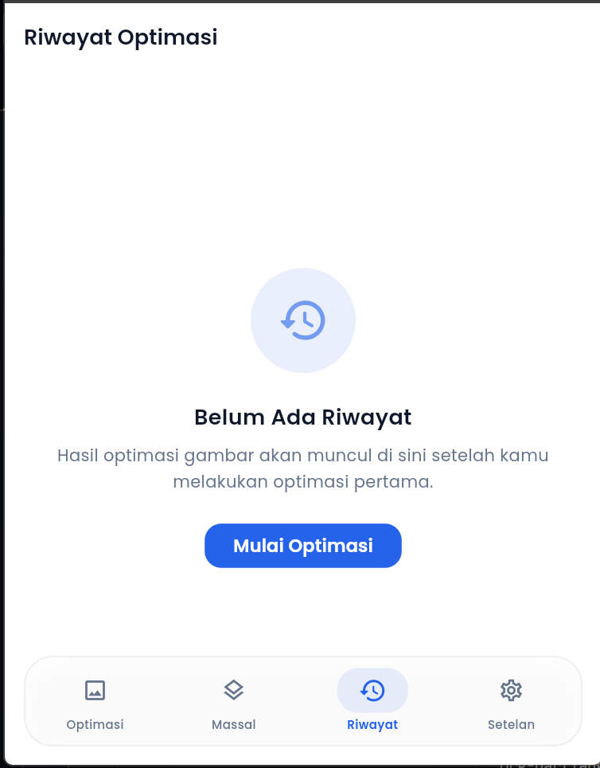
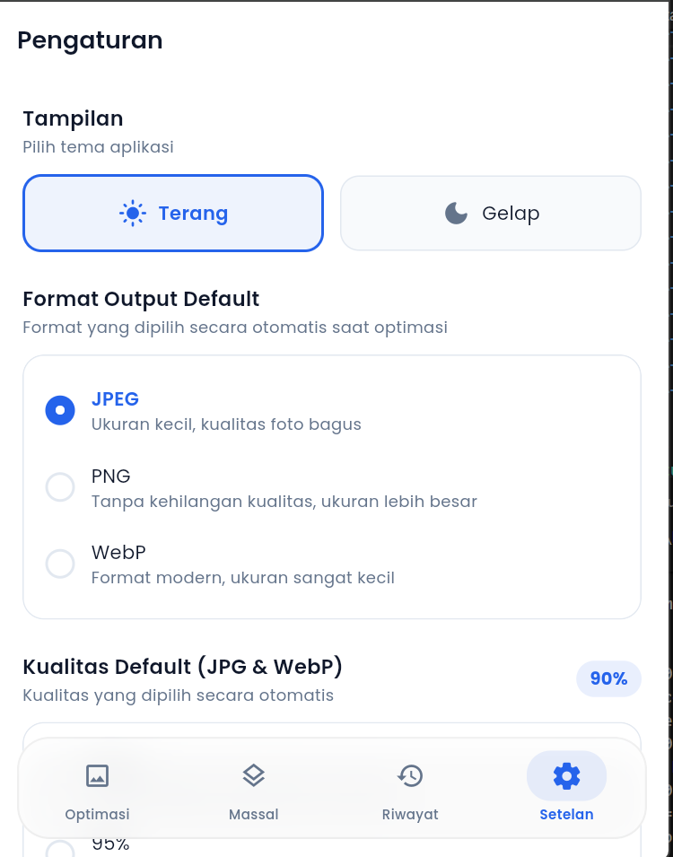
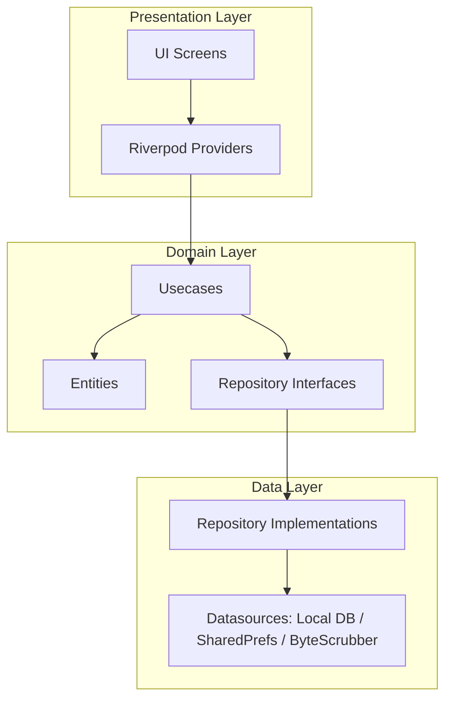

# Promptix 📸 — AI Metadata Cleaner & Image Optimizer

[](https://flutter.dev)
[](https://dart.dev)
[](#)
[](LICENSE)

**Promptix** adalah aplikasi seluler & web berbasis Flutter untuk melakukan optimasi ukuran gambar serta membersihkan metadata secara 100% lokal. Promptix melindungi privasi Anda dengan melacak dan menghapus tanda tangan buatan AI (seperti Midjourney, DALL-E, dll.) dan metadata provenance (C2PA) di tingkat byte raw biner, serta menawarkan sistem **EXIF Spoofing** yang sangat canggih.

---

## 📸 Tangkapan Layar Aplikasi (App Showcase)

Berikut adalah beberapa tampilan fitur utama Promptix di perangkat Anda:

<table style="width: 100%; border-collapse: collapse; text-align: center;">
  <tr>
    <td style="width: 50%; padding: 10px;">
      <strong>Dasbor Utama (Optimasi Tunggal)</strong><br/><br/>
      
    </td>
    <td style="width: 50%; padding: 10px;">
      <strong>Pembersihan Massal (Bulk Clean)</strong><br/><br/>
      
    </td>
  </tr>
  <tr>
    <td style="width: 50%; padding: 10px;">
      <strong>Riwayat Optimasi Lokal</strong><br/><br/>
      
    </td>
    <td style="width: 50%; padding: 10px;">
      <strong>Pengaturan Global & Preferensi</strong><br/><br/>
      
    </td>
  </tr>
</table>

---

## 🛠️ Ringkasan Fitur Utama

1.  **Optimasi & Kompresi Fleksibel**: Kompresi gambar JPEG, PNG, dan WebP dengan presisi slider kualitas dari 1% hingga 100%.
2.  **Scrubber Biner C2PA & AI Signature**: Penghapusan metadata C2PA (*Content Credentials*) dan string teks generator AI langsung dari *raw byte biner* berkas tanpa merusak pixel gambar asli.
3.  **Pemalsuan / Spoofing EXIF**: Mengubah informasi kamera pengambil foto dengan profil buatan (seperti Apple, Samsung, Google Pixel, Sony, Canon, dll.) termasuk penyuntikan titik koordinat GPS palsu dan modifikasi timestamp secara dinamis.
4.  **Sistem Watermarking**: Memberikan perlindungan hak cipta visual dengan menempelkan logo kustom di berbagai posisi dengan opasitas dan skala proporsional yang dapat diatur.
5.  **Pembersihan Massal**: Memproses pembersihan tanda AI dan C2PA pada puluhan gambar sekaligus secara asinkron dalam satu antrean cepat.
6.  **Penyimpanan Riwayat SQLite**: Menyimpan setiap riwayat hasil optimasi di penyimpanan lokal perangkat yang aman.

---

## 📚 Pusat Dokumentasi Fitur (Feature Docs Hub)

Kami telah menyusun 5 berkas dokumentasi teknis super lengkap yang membahas cara kerja dan detail arsitektur dari setiap fitur di Promptix. Silakan baca berkas-berkas di bawah ini untuk pemahaman mendalam:

*   📖 **[Dokumentasi Fitur 1: Optimasi & Pembersihan Metadata Gambar Tunggal](docs/1_single_optimization.md)**
    *   *Membahas alur pemrosesan asinkron, decoding, konfigurasi resolusi, kompresi non-blocking di utas latar belakang (Isolate), serta MediaScanner Android.*
*   📖 **[Dokumentasi Fitur 2: Pembersihan Massal & Byte-Level Scrubber C2PA](docs/2_bulk_cleaning.md)**
    *   *Membahas mekanisme pembersihan tingkat byte raw untuk JPEG, PNG, dan WebP, pemotongan segment JUMBF/XMP, serta penyaringan kata kunci AI.*
*   📖 **[Dokumentasi Fitur 3: Manajemen Profil & Spoofing EXIF](docs/3_exif_profiles.md)**
    *   *Membahas 10 profil preset kamera fisik, penyusunan EXIF buatan menggunakan kalkulasi `Rational`, GPS spoofing, manipulasi timestamp, serta ekspor-impor profil kustom via JSON.*
*   📖 **[Dokumentasi Fitur 4: Mesin Penanda Air (Watermarking)](docs/4_watermark_management.md)**
    *   *Membahas alur penyimpanan lokal logo kustom, kalkulasi skala lebar gambar target, penyesuaian alpha channel (RGBA), opasitas, dan layout komposit.*
*   📖 **[Dokumentasi Fitur 5: Riwayat Penyimpanan & Pengaturan Preferensi](docs/5_settings_history.md)**
    *   *Membahas skema tabel database SQLite lokal, manajemen state reaktif di Riverpod, pemanfaatan SharedPreferences untuk preferensi global, dan fallback web.*

---

## 📐 Arsitektur Kode (Clean Architecture)

Aplikasi dibangun menggunakan pola **Clean Architecture** yang memisahkan tanggung jawab kode secara bersih ke dalam tiga lapisan utama:



*   **Presentation Layer**: Berisi halaman UI (`Screens`), widget modular, dan `StateNotifierProvider` Riverpod yang menjembatani data ke antarmuka pengguna.
*   **Domain Layer**: Merupakan jantung bisnis aplikasi yang terbebas dari ketergantungan luar. Terdiri atas berkas `Entities` (struktur data murni) dan `Usecases` (logika bisnis spesifik).
*   **Data Layer**: Lapisan terluar yang menangani implementasi penyimpanan data konkret (`Repositories`) dan komunikasi API/database (`Datasources` seperti SQLite, SharedPreferences, & C2paScrubber).

---

## 🚀 Memulai Penggunaan (Getting Started)

### Prasyarat:
*   [Flutter SDK](https://docs.flutter.dev/get-started/install) versi `>= 3.0.0`
*   [Dart SDK](https://dart.dev/get-started) versi `>= 3.0.0`

### Cara Menjalankan Proyek:

1.  Kloning repositori GitHub ini:
    ```bash
    git clone https://github.com/dresar/promptix.git
    cd promptix
    ```
2.  Ambil semua dependensi pustaka:
    ```bash
    flutter pub get
    ```
3.  Jalankan aplikasi di perangkat emulator/fisik Anda:
    ```bash
    flutter run
    ```
4.  Untuk kompilasi versi rilis produksi (Android):
    ```bash
    flutter build apk --release
    ```

---

## 📄 Lisensi (License)

Proyek ini dilisensikan di bawah **MIT License**. Silakan tinjau berkas [LICENSE](LICENSE) untuk informasi lebih lanjut.
