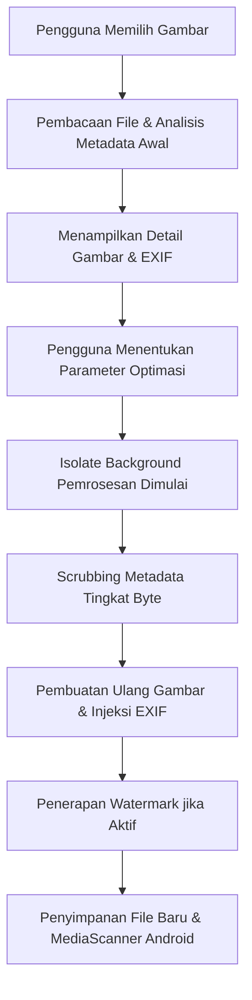

# Dokumentasi Fitur 1: Optimasi & Pembersihan Metadata Gambar Tunggal

Fitur **Optimasi & Pembersihan Metadata Gambar Tunggal** adalah salah satu fitur inti dari Promptix yang memungkinkan pengguna memuat, memeriksa, dan membersihkan metadata gambar secara individual dengan kontrol penuh terhadap kualitas kompresi, format keluaran, penandaan air (watermark), dan pemalsuan profil EXIF.

---

## 1. Alur Kerja (Workflow) Pemrosesan

Proses pembersihan dan optimasi gambar tunggal mengikuti pipa pemrosesan asinkron berkinerja tinggi sebagai berikut:



---

## 2. Deskripsi Detail Komponen & Alur

### A. Pengambilan Gambar (Image Picking)
Pengguna dapat memilih gambar melalui layar `PickImageScreen` ([pick_image_screen.dart](file:///c:/Users/NCN0C/Documents/promptix/lib/presentation/screens/pick_image/pick_image_screen.dart)). Layar ini mendukung:
*   Pemilihan dari galeri lokal perangkat.
*   Pemilihan langsung melalui manajer file (file picker).
*   Validasi format dan ketersediaan file.

### B. Analisis Metadata Gambar (`readImageInfo`)
Sebelum melakukan tindakan apa pun, file dibaca oleh `ImageProcessingDatasource` ([image_processing_datasource.dart](file:///c:/Users/NCN0C/Documents/promptix/lib/data/datasources/image_processing_datasource.dart)) melalui metode `readImageInfo`. Metode ini melakukan beberapa hal:
1.  **Deteksi Byte Raw**: Membaca file gambar sebagai *raw bytes* (`Uint8List`).
2.  **Pemindaian AI & C2PA**: Memindai keberadaan tanda tangan digital AI (seperti Midjourney, Dall-E, dll.) dan metadata provenance C2PA.
3.  **Ekstraksi EXIF**: Mendecode data EXIF menggunakan pustaka `image` Dart dan memetakan kunci tag EXIF mentah ke format bahasa yang mudah dibaca oleh pengguna (contoh: `Make` ➔ `Merek Kamera`, `FNumber` ➔ `Aperture (F-Number)`, `GPSLatitude` ➔ `GPS Latitude`).

Data hasil analisis dibungkus dalam entitas `ImageInfoEntity` ([image_info_entity.dart](file:///c:/Users/NCN0C/Documents/promptix/lib/domain/entities/image_info_entity.dart)) dan ditampilkan di layar `ImageInfoScreen` ([image_info_screen.dart](file:///c:/Users/NCN0C/Documents/promptix/lib/presentation/screens/image_info/image_info_screen.dart)).

### C. Konfigurasi Parameter (Layar `OptimizeScreen`)
Di layar `OptimizeScreen` ([optimize_screen.dart](file:///c:/Users/NCN0C/Documents/promptix/lib/presentation/screens/optimize/optimize_screen.dart)), pengguna diberikan berbagai parameter untuk disesuaikan:
*   **Format Output**: Pilihan antara `JPEG`, `PNG`, atau `WebP`.
*   **Kualitas Kompresi**: Slider untuk mengatur tingkat kompresi dari `1%` hingga `100%` (hanya berlaku untuk JPEG dan WebP).
*   **Awalan Nama File (Prefix)**: Menentukan awalan nama berkas keluaran (contoh: `PROMPTIX_`).
*   **Profil Metadata**: Menentukan jenis profil EXIF yang akan diterapkan pada gambar baru (selengkapnya di [Dokumentasi Profil EXIF](3_exif_profiles.md)).
*   **Watermark**: Opsi untuk menerapkan logo watermark (selengkapnya di [Dokumentasi Watermark](4_watermark_management.md)).

### D. Pemrosesan Non-Blocking di Isolate Background (`_optimizeImageInIsolate`)
Karena decoding, manipulasi pixel, menggambar watermark, dan encoding gambar adalah operasi intensif CPU yang dapat membekukan UI utama Flutter (*jank*), Promptix memanfaatkan fungsi `compute` Dart untuk memproses data di utas latar belakang (*Isolate*).

Di dalam isolate:
1.  **Pembersihan Total**: Objek gambar didecode, dan semua metadata asli langsung dihapus secara total:
    ```dart
    decoded.exif = img.ExifData();
    decoded.textData = null;
    decoded.iccProfile = null;
    ```
2.  **Injeksi EXIF Baru**: Profil metadata yang dipilih pengguna (baik profil kustom maupun preset) disintesis dan dimasukkan ke dalam objek data EXIF gambar.
3.  **Penggabungan Watermark**: Jika diaktifkan, logo watermark digambar di atas koordinat piksel yang ditentukan.
4.  **Kompresi Akhir**: Gambar diencode ke dalam format target (`img.encodeJpg`, `img.encodePng`, atau `img.encodeWebP`) dengan tingkat kualitas yang diinginkan.

### E. Penyimpanan & Integrasi Sistem (MediaScanner)
Setelah byte keluaran diterima dari isolate, berkas disimpan di media penyimpanan lokal:
*   **Android**: Berkas disimpan secara rapi di direktori publik `/Pictures/Promptix` menggunakan jalur penyimpanan eksternal. Agar gambar yang baru disimpan langsung muncul di Galeri sistem tanpa memerlukan restart perangkat, Promptix memicu `MediaScanner` Android melalui `MethodChannel`:
    ```dart
    const channel = MethodChannel('com.example.promptix/media_scanner');
    await channel.invokeMethod('scanFile', {'path': outputPath});
    ```
*   **Web / Platform Lain**: Jalur disesuaikan menggunakan cache gambar lokal atau direktori dokumen aplikasi.

Hasil akhir dibungkus ke dalam `OptimizationResultEntity` ([optimization_result_entity.dart](file:///c:/Users/NCN0C/Documents/promptix/lib/domain/entities/optimization_result_entity.dart)) dan ditampilkan pada `ResultScreen` ([result_screen.dart](file:///c:/Users/NCN0C/Documents/promptix/lib/presentation/screens/result/result_screen.dart)), yang memperlihatkan perbandingan ukuran file sebelum dan sesudah optimasi secara interaktif.
