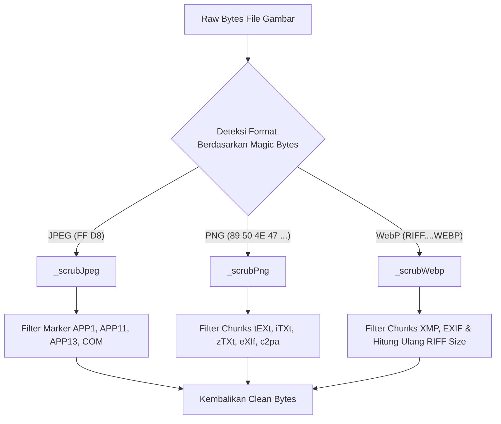

# Dokumentasi Fitur 2: Pembersihan Massal & Deteksi/Pembersihan Byte-Level C2PA & AI Signature

Fitur **Pembersihan Massal** (Bulk Cleaning) pada Promptix dirancang untuk memproses banyak gambar sekaligus secara efisien. Keunikan dari fitur ini terletak pada penggunaan **Raw Byte-Level Scrubber** yang beroperasi langsung pada struktur biner file gambar sebelum didecode oleh pustaka grafis. Hal ini menjamin bahwa seluruh data provenance (C2PA) dan jejak tanda tangan generator AI (seperti Midjourney, DALL-E, atau ComfyUI) benar-benar terhapus bersih secara permanen.

---

## 1. Arus Logika Pembersihan Byte-Level

Pembersihan tingkat byte dilakukan secara efisien tanpa melakukan kompresi ulang gambar pada langkah awal, sehingga proses pencarian dan penghapusan *metadata segment* berlangsung sangat cepat (dalam hitungan milidetik per gambar).

---

## 2. Struktur Kode Scrubber Mentah (`c2pa_scrubber.dart`)

Implementasi utama berada pada berkas `C2paScrubber` ([c2pa_scrubber.dart](file:///c:/Users/NCN0C/Documents/promptix/lib/data/datasources/c2pa_scrubber.dart)).

### A. Strategi Pembersihan per Format File

#### 1. Format JPEG (`_scrubJpeg`)
JPEG menyusun data dalam beberapa segmen yang diawali dengan penanda (*marker*) berukuran 2 byte (dimulai dengan `0xFF`). `C2paScrubber` memilah penanda tersebut satu per satu:
*   **APP1 (0xE1)**: Digunakan untuk EXIF dan data XMP. Jika segmen ini mengandung informasi XMP atau mengandung kata kunci C2PA, segmen ini langsung dibuang (`APP1-XMP`).
*   **APP11 (0xEB)**: Penanda standar untuk segmen JUMBF (yang digunakan oleh spesifikasi C2PA untuk menyimpan *Content Credentials*). Segmen ini **selalu dihapus**.
*   **APP13 (0xED)**: Menyimpan IPTC / Photoshop Image Resource Block yang sering kali membawa metadata kepemilikan AI. Segmen ini dibuang.
*   **APP14 (0xEE)** & **APP15 (0xEF)**: Segmen konfigurasi tambahan Adobe yang sering memuat data metadata tersembunyi.
*   **COM (0xFE)**: Segmen komentar gambar. Segmen ini dibuang jika mengandung kata kunci AI.

#### 2. Format PNG (`_scrubPng`)
PNG membagi data ke dalam blok-blok bernama *chunks*. Setiap chunk memiliki panjang data 4-byte, nama chunk 4-byte, data, dan kode CRC 4-byte. Scrubber memindai dan membuang chunk berikut:
*   **tEXt, iTXt, zTXt**: Chunk teks yang menyimpan pasangan kunci-nilai (sering digunakan oleh generator AI seperti Stable Diffusion/ComfyUI untuk menyimpan parameter prompt pembuatan). Chunk ini dibuang jika mengandung kata kunci AI atau metadata XMP.
*   **eXIf**: Menyimpan profil EXIF mentah.
*   **caBX, c2pa, JUMB**: Chunk khusus yang digunakan untuk menyimpan metadata provenance C2PA.

#### 3. Format WebP (`_scrubWebp`)
Struktur WebP berbasis format wadah RIFF. Scrubber membaca struktur chunk WebP dan memotong chunk:
*   `XMP ` (menyimpan metadata XMP dan C2PA).
*   `EXIF` (menyimpan data EXIF).
*   **Koreksi Ukuran**: Setelah memotong chunk tersebut, ukuran header berkas RIFF utama (4 byte pertama setelah string `'RIFF'`) dihitung dan ditulis ulang agar berkas WebP tetap valid dan tidak rusak (*corrupt*).

---

## 3. Deteksi Tanda Tangan AI (AI Signature)

Sebelum dibersihkan, Promptix juga memindai gambar untuk mendeteksi apakah gambar tersebut dibuat oleh kecerdasan buatan. Hal ini dilakukan dengan memindai string teks pada 64KB byte pertama gambar untuk mencocokkan kata kunci populer:

*   **Daftar Kata Kunci Deteksi AI**:
    `midjourney`, `dall-e`, `dall·e`, `stable diffusion`, `adobe firefly`, `firefly`, `kling`, `runway`, `leonardo`, `pika`, `ideogram`, `flux`, `sora`, `imagen`, `dreamstudio`, `nightcafe`, `civitai`, `playground ai`, dll.
*   **Deteksi Perangkat Lunak AI**: Memeriksa *software signatures* seperti `automatic1111`, `a1111`, `comfyui`, `invokeai`, `fooocus`.

---

## 4. UI Pembersihan Massal (`batch_clean_screen.dart`)

Layar `BatchCleanScreen` ([batch_clean_screen.dart](file:///c:/Users/NCN0C/Documents/promptix/lib/presentation/screens/batch_clean/batch_clean_screen.dart)) mengintegrasikan prosesor di atas untuk memberikan pengalaman pengguna yang mulus:
1.  **Pemilihan Banyak File**: Memungkinkan pengguna memilih lebih dari satu berkas gambar dari galeri perangkat.
2.  **Antrean Pemrosesan (Queue)**: Menampilkan daftar gambar yang siap dibersihkan beserta ukuran file aslinya.
3.  **Indikator Kemajuan (Progress Indicator)**: Menampilkan bilah kemajuan (*progress bar*) interaktif saat pembersihan massal berjalan di latar belakang.
4.  **Ringkasan Hasil (Summary)**: Setelah proses selesai, pengguna disajikan statistik jumlah berkas yang berhasil dibersihkan, total ruang penyimpanan yang dihemat, serta opsi untuk membuka folder tujuan secara langsung.
