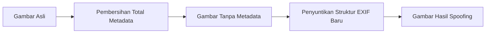

# Dokumentasi Fitur 3: Manajemen Profil & Spoofing EXIF

Fitur **Manajemen Profil & Spoofing EXIF** di Promptix memungkinkan pengguna menyembunyikan identitas perangkat asli mereka dengan memalsukan metadata EXIF gambar agar terlihat seolah-olah diambil oleh kamera fisik populer atau diproses oleh perangkat lunak tertentu. Pengguna dapat memilih dari berbagai preset bawaan atau merancang profil kustom mereka sendiri secara detail.

---

## 1. Konsep Spoofing EXIF

Saat gambar dibersihkan, Promptix menghapus metadata asli secara menyeluruh. Jika pengguna mengaktifkan profil EXIF tertentu, Promptix akan merangkai struktur metadata EXIF baru berdasarkan nilai profil tersebut dan menyuntikkannya kembali ke dalam gambar keluaran:

---

## 2. Profil Preset Bawaan (Built-in Profiles)

Promptix menyediakan 10 profil bawaan yang dikonfigurasi secara realistis berdasarkan kamera asli di pasar:

| ID Profil | Nama Profil | Merek Kamera | Model Kamera | Software / Perangkat Lunak | Lensa / Parameter Tambahan |
| :--- | :--- | :--- | :--- | :--- | :--- |
| `clean` | Clean (Tanpa Metadata) | - | - | - | Tidak menyuntikkan EXIF apa pun |
| `iphone15pro` | Apple iPhone 15 Pro | `Apple` | `iPhone 15 Pro` | `17.5.1` | Lensa 6.765mm f/1.78, ISO 100, 1/120s |
| `samsungS24Ultra`| Samsung Galaxy S24 Ultra | `samsung` | `SM-S928B` | `SM-S928BXXU1AXB5` | Lensa 6.3mm f/1.7, ISO 50, 1/180s |
| `pixel9pro` | Google Pixel 9 Pro | `Google` | `Pixel 9 Pro` | `Pixel Experience 14` | Lensa rear f/1.68, ISO 66, 1/200s |
| `sonyXperia1VI` | Sony Xperia 1 VI | `Sony` | `XQ-EC54` | `65.2.A.0.404` | Lensa 4mm f/1.9, ISO 125, 1/250s |
| `canonEosR6` | Canon EOS R6 Mark II | `Canon` | `Canon EOS R6 Mark II` | `Digital Photo Professional 4.22.30` | Lensa RF 50mm F1.8 STM, ISO 400, 1/500s |
| `nikonZ8` | Nikon Z8 | `NIKON CORPORATION` | `NIKON Z 8` | `Ver.1.30` | Lensa NIKKOR Z 50mm f/1.8 S, ISO 200, 1/640s |
| `fujifilmXT5` | Fujifilm X-T5 | `FUJIFILM` | `X-T5` | `Fujifilm X RAW STUDIO` | Lensa XF23mmF1.4 R LM WR, ISO 160, 1/400s |
| `djiMini4Pro` | DJI Mini 4 Pro | `DJI` | `FC4582` | `01.00.0500` | Lensa 4.5mm f/1.7, ISO 100, 1/1000s |
| `photoshop` | Adobe Photoshop 2026 | - | - | `Adobe Photoshop 26.0 (Windows)` | Menghilangkan info kamera, menyisakan info editor |

---

## 3. Profil Kustom (Custom Profiles)

Pengguna dapat membuat dan mengedit profil mereka sendiri melalui layar `ExifProfileScreen` ([exif_profile_screen.dart](file:///c:/Users/NCN0C/Documents/promptix/lib/presentation/screens/exif_profile/exif_profile_screen.dart)). Layar ini menyimpan pengaturan ke dalam model data `ExifProfileEntity` ([exif_profile_entity.dart](file:///c:/Users/NCN0C/Documents/promptix/lib/domain/entities/exif_profile_entity.dart)).

### A. Parameter yang Dapat Disesuaikan:

1.  **Informasi Kamera**:
    *   Merek & Model Kamera (`cameraMake`, `cameraModel`).
    *   Model Lensa (`lensModel`).
    *   Perangkat Lunak Pemproses (`software`).
2.  **Parameter Pajanan (Exposure Parameters)**:
    *   ISO Speed (`isoSpeed`).
    *   Aperture / Bukaan (`apertureF`, contoh: `1.8`, `2.8`).
    *   Kecepatan Rana / Shutter Speed (`shutterSpeedDenom`, contoh: `500` untuk `1/500` detik).
    *   Panjang Fokus / Focal Length (`focalLengthMm`).
    *   Mode White Balance & Flash (`whiteBalanceMode`, `flashMode`).
3.  **Kreator & Hak Cipta**:
    *   Nama Fotografer / Artis (`artistName`).
    *   Klaim Hak Cipta (`copyright`).
4.  **Manipulasi Waktu (Timestamp Manipulation)**:
    *   `current`: Menggunakan waktu saat optimasi berjalan.
    *   `fixed`: Mundur persis sejumlah hari yang ditentukan oleh pengguna (`timestampOffsetDays`).
    *   `random`: Menghasilkan waktu acak ke belakang dalam batas rentang hari offset (`timestampOffsetDays`).
5.  **Pemalsuan Lokasi (GPS Spoofing)**:
    *   Mengaktifkan koordinat GPS buatan (`enableGps`).
    *   Mengisi nilai Latitude (Garis Lintang), Longitude (Garis Bujur), dan Altitude (Ketinggian dalam meter).
    *   Memberi nama label lokasi (`gpsLocationName`, contoh: "Monas, Jakarta").

---

## 4. Manajemen Penyimpanan & Portabilitas Profil

Profil kustom yang dibuat pengguna disimpan secara lokal melalui `ExifProfileDatasource` ([exif_profile_datasource.dart](file:///c:/Users/NCN0C/Documents/promptix/lib/data/datasources/local/exif_profile_datasource.dart)) menggunakan pustaka `shared_preferences`.

Fitur ini mendukung portabilitas profil:
*   **Simpan/Ubah**: Data disimpan dalam daftar JSON String terenkapsulasi di bawah kunci `'custom_exif_profiles'`.
*   **Ekspor Profil**: Pengguna dapat mengekspor seluruh profil kustom mereka ke dalam satu file berkas JSON string melalui fungsi `exportAllProfiles()`.
*   **Impor Profil**: Pengguna dapat mengimpor profil buatan orang lain secara praktis melalui fungsi `importProfileFromJson(String jsonStr)`. Saat diimpor, sistem secara otomatis memastikan bendera `isBuiltIn` diset ke `false` agar profil tersebut tetap dapat dimodifikasi atau dihapus oleh pengguna.
