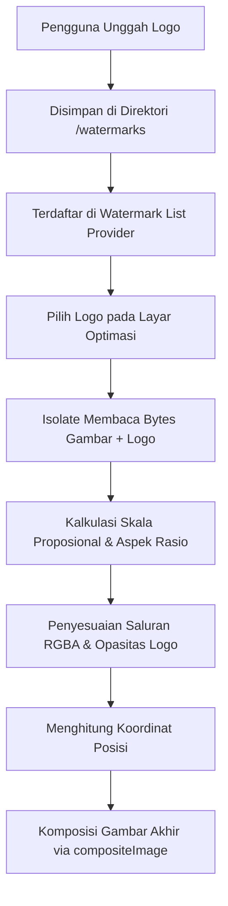

# Dokumentasi Fitur 4: Mesin Penanda Air (Watermarking Engine)

Fitur **Mesin Penanda Air** (Watermarking Engine) pada Promptix memberikan solusi perlindungan hak cipta gambar secara visual dengan menyematkan logo kustom di atas gambar yang dioptimalkan. Pemrosesan ini dirancang agar proporsional terhadap ukuran gambar asli dan mendukung transparansi penuh.

---

## 1. Alur Manajemen & Penerapan Watermark

Alur penanganan watermark terbagi menjadi dua bagian: pengelolaan aset logo secara lokal dan penggabungan grafis secara dinamis saat proses optimasi berjalan.



---

## 2. Penyimpanan Aset Lokal (`watermark_service.dart`)

Penyimpanan logo dikelola oleh `WatermarkService` ([watermark_service.dart](file:///c:/Users/NCN0C/Documents/promptix/lib/services/watermark_service.dart)).
*   **Direktori Khusus**: Logo disimpan di sub-direktori internal aplikasi bernama `watermarks` (`getApplicationDocumentsDirectory()/watermarks`).
*   **Operasi CRUD**:
    *   `saveWatermark(File originalFile)`: Menyalin berkas logo yang dipilih pengguna ke direktori khusus dengan nama yang unik.
    *   `getWatermarks()`: Mengembalikan daftar semua berkas logo yang tersimpan.
    *   `deleteWatermark(File watermarkFile)`: Menghapus berkas logo secara fisik dari penyimpanan lokal.

Status daftar logo ini dijaga secara reaktif di tingkat UI menggunakan `WatermarkListNotifier` ([watermark_provider.dart](file:///c:/Users/NCN0C/Documents/promptix/lib/presentation/providers/watermark_provider.dart)) yang ditenagai oleh Riverpod.

---

## 3. Logika Pemrosesan Grafis Watermark

Penerapan watermark dilakukan secara efisien di dalam isolate background untuk menghindari pelambatan UI. Proses ini ditangani langsung dalam fungsi `_optimizeImageInIsolate` di [image_processing_datasource.dart](file:///c:/Users/NCN0C/Documents/promptix/lib/data/datasources/image_processing_datasource.dart):

### A. Penskalaan Proporsional (Proportional Scaling)
Jika watermark diterapkan secara statis tanpa memperhitungkan resolusi gambar target, logo akan terlihat terlalu besar pada gambar beresolusi rendah atau terlalu kecil pada gambar beresolusi tinggi (misalnya hasil foto kamera 50 MP).
Promptix memecahkan masalah ini dengan menghitung dimensi logo baru berdasarkan persentase skala terhadap lebar gambar target:
```dart
final scale = params.watermarkScale; // Contoh: 0.15 (15% dari lebar gambar utama)
final targetWidth = (decoded.width * scale).round();
final aspectRatio = logoImage.width / logoImage.height;
final targetHeight = (targetWidth / aspectRatio).round();

// Resize logo dengan interpolasi berkualitas
final resizedLogo = img.copyResize(
  logoImage,
  width: targetWidth,
  height: targetHeight,
  interpolation: img.Interpolation.average,
);
```

### B. Konversi Ruang Warna & Opasitas (RGBA Channel Blending)
Untuk memastikan logo watermark yang memiliki latar belakang transparan dapat menyatu dengan benar di atas gambar utama, Promptix melakukan pengecekan dan konversi saluran warna (*color channels*):
1.  **Konversi ke Saluran 4 (RGBA)**: Jika logo yang dimuat hanya memiliki 3 saluran warna (RGB tanpa transparansi), Promptix membuat kanvas baru berukuran sama dengan 4 saluran warna (RGBA) dan menyalin logo tersebut ke dalamnya.
2.  **Modifikasi Alpha Channel**: Jika nilai opasitas diatur kurang dari 1.0 (100%), setiap piksel logo akan dimodifikasi nilai alpha-nya secara langsung:
    ```dart
    final opacity = params.watermarkOpacity; // Contoh: 0.8 (opasitas 80%)
    if (opacity < 1.0) {
      for (final pixel in watermark) {
        pixel.a = (pixel.a * opacity).round();
      }
    }
    ```

### C. Penentuan Posisi Komposit (Placement)
Pengguna dapat memilih salah satu dari 4 opsi tata letak dengan margin aman sebesar `20` piksel dari tepi gambar:
*   **Top Left (Kiri Atas)**: `x = 20`, `y = 20`
*   **Top Right (Kanan Atas)**: `x = lebar_gambar - lebar_logo - 20`, `y = 20`
*   **Bottom Left (Kiri Bawah)**: `x = 20`, `y = tinggi_gambar - tinggi_logo - 20`
*   **Bottom Right (Kanan Bawah - Default)**: `x = lebar_gambar - lebar_logo - 20`, `y = tinggi_gambar - tinggi_logo - 20`

Koordinat tersebut dikunci (*clamped*) agar tidak melebihi batas luar gambar utama, kemudian digabungkan secara destruktif menggunakan operasi penimpaan piksel `img.compositeImage`.
